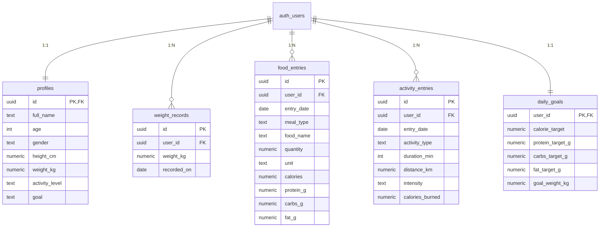

# FitTrack AI — Database Schema

This document is generated from the SQL migrations under
[`supabase/migrations/`](../supabase/migrations/). All tables live in the
`public` schema. Every table has:

- `created_at timestamptz NOT NULL DEFAULT now()`
- `updated_at timestamptz NOT NULL DEFAULT now()` — kept in sync via the
  `public.set_updated_at()` `BEFORE UPDATE` trigger.
- Row Level Security (RLS) enabled, with policies restricting `SELECT`,
  `INSERT`, `UPDATE`, and `DELETE` to rows owned by the current
  `auth.uid()`.

An `after insert on auth.users` trigger (`on_auth_user_created` →
`public.handle_new_user()`) automatically seeds an empty `profiles` row for
every newly created auth user.

---

## `profiles`

Personal / physiological details used to compute BMR, TDEE, and calorie
targets. There is exactly one row per user (`profiles.id = auth.users.id`).

| Column          | Type            | Nullable | Constraints                                                                   | Notes                                                     |
| --------------- | --------------- | -------- | ----------------------------------------------------------------------------- | --------------------------------------------------------- |
| `id`            | `uuid`          | No       | PK, FK → `auth.users(id)` `ON DELETE CASCADE`                                 | Matches the auth user's ID.                               |
| `full_name`     | `text`          | Yes      |                                                                               | Optional display name.                                    |
| `age`           | `integer`       | Yes      | `CHECK (age BETWEEN 10 AND 120)`                                              |                                                           |
| `gender`        | `text`          | Yes      | `CHECK (gender IN ('male','female','other'))`                                 |                                                           |
| `height_cm`     | `numeric(5,2)`  | Yes      | `CHECK (height_cm BETWEEN 50 AND 272)`                                        |                                                           |
| `weight_kg`     | `numeric(5,2)`  | Yes      | `CHECK (weight_kg BETWEEN 20 AND 500)`                                        |                                                           |
| `activity_level`| `text`          | Yes      | `CHECK (activity_level IN ('sedentary','light','moderate','active','very_active'))` |                                                       |
| `goal`          | `text`          | Yes      | `CHECK (goal IN ('lose_weight','maintain_weight','gain_weight','gain_muscle'))` |                                                        |
| `created_at`    | `timestamptz`   | No       | Default `now()` (UTC)                                                         |                                                           |
| `updated_at`    | `timestamptz`   | No       | Default `now()`, kept fresh by trigger                                        |                                                           |

**Triggers:**

- `profiles_set_updated_at` — `BEFORE UPDATE` → `public.set_updated_at()`.
- `on_auth_user_created` (on `auth.users`) — `AFTER INSERT` → `public.handle_new_user()` seeds a stub row.

**Policies (all `USING`/`WITH CHECK auth.uid() = id`):**

- `profiles_select_own`
- `profiles_insert_own`
- `profiles_update_own`
- `profiles_delete_own`

---

## `weight_records`

Append-only log of the user's measured bodyweight. One row per user per day
(the profile save also upserts today's weight into this table).

| Column        | Type            | Nullable | Constraints                                                | Notes                                     |
| ------------- | --------------- | -------- | ---------------------------------------------------------- | ----------------------------------------- |
| `id`          | `uuid`          | No       | PK, default `gen_random_uuid()`                            |                                           |
| `user_id`     | `uuid`          | No       | FK → `auth.users(id)` `ON DELETE CASCADE`                  |                                           |
| `weight_kg`   | `numeric(5,2)`  | No       | `CHECK (weight_kg BETWEEN 20 AND 500)`                     |                                           |
| `recorded_on` | `date`          | No       | Default `current_date`                                     |                                           |
| `created_at`  | `timestamptz`   | No       | Default `now()`                                            |                                           |
| `updated_at`  | `timestamptz`   | No       | Default `now()`, kept fresh by trigger                     |                                           |
| —             | —               | —        | `UNIQUE (user_id, recorded_on)`                            | Prevents duplicate daily entries per user |

**Indexes:** `weight_records_user_recorded_idx` on `(user_id, recorded_on DESC)`.

**Policies:** `weight_records_select_own`, `_insert_own`, `_update_own`,
`_delete_own` — all restrict to `auth.uid() = user_id`.

---

## `food_entries`

One row per logged food / drink item.

| Column        | Type            | Nullable | Constraints                                                                        |
| ------------- | --------------- | -------- | ---------------------------------------------------------------------------------- |
| `id`          | `uuid`          | No       | PK, default `gen_random_uuid()`                                                    |
| `user_id`     | `uuid`          | No       | FK → `auth.users(id)` `ON DELETE CASCADE`                                          |
| `entry_date`  | `date`          | No       | Default `current_date`                                                             |
| `meal_type`   | `text`          | No       | `CHECK (meal_type IN ('breakfast','lunch','dinner','snack'))`                      |
| `food_name`   | `text`          | No       | `CHECK (length(food_name) BETWEEN 1 AND 200)`                                      |
| `quantity`    | `numeric(10,2)` | No       | `CHECK (quantity > 0)`                                                             |
| `unit`        | `text`          | No       | `CHECK (length(unit) BETWEEN 1 AND 20)`                                            |
| `calories`    | `numeric(10,2)` | No       | Default 0, `CHECK (calories >= 0)`                                                 |
| `protein_g`   | `numeric(10,2)` | No       | Default 0, `CHECK (protein_g >= 0)`                                                |
| `carbs_g`     | `numeric(10,2)` | No       | Default 0, `CHECK (carbs_g >= 0)`                                                  |
| `fat_g`       | `numeric(10,2)` | No       | Default 0, `CHECK (fat_g >= 0)`                                                    |
| `created_at`  | `timestamptz`   | No       | Default `now()`                                                                    |
| `updated_at`  | `timestamptz`   | No       | Default `now()`, kept fresh by trigger                                             |

**Indexes:** `food_entries_user_date_idx` on `(user_id, entry_date DESC)`.

**Policies:** `food_entries_select_own`, `_insert_own`, `_update_own`,
`_delete_own` — all restrict to `auth.uid() = user_id`.

---

## `activity_entries`

One row per logged workout / physical activity.

| Column            | Type            | Nullable | Constraints                                                                                                    |
| ----------------- | --------------- | -------- | -------------------------------------------------------------------------------------------------------------- |
| `id`              | `uuid`          | No       | PK, default `gen_random_uuid()`                                                                                |
| `user_id`         | `uuid`          | No       | FK → `auth.users(id)` `ON DELETE CASCADE`                                                                      |
| `entry_date`      | `date`          | No       | Default `current_date`                                                                                         |
| `activity_type`   | `text`          | No       | `CHECK (activity_type IN ('walking','running','swimming','cycling','weight_training','other'))`               |
| `duration_min`    | `integer`       | No       | `CHECK (duration_min > 0 AND duration_min <= 1440)`                                                            |
| `distance_km`     | `numeric(6,2)`  | Yes      | `CHECK (distance_km IS NULL OR distance_km >= 0)`                                                              |
| `intensity`       | `text`          | No       | `CHECK (intensity IN ('low','moderate','high'))`                                                               |
| `calories_burned` | `numeric(10,2)` | No       | Default 0, `CHECK (calories_burned >= 0)`. Set by the app using MET × weight × time.                           |
| `created_at`      | `timestamptz`   | No       | Default `now()`                                                                                                |
| `updated_at`      | `timestamptz`   | No       | Default `now()`, kept fresh by trigger                                                                         |

**Indexes:** `activity_entries_user_date_idx` on `(user_id, entry_date DESC)`.

**Policies:** `activity_entries_select_own`, `_insert_own`, `_update_own`,
`_delete_own` — all restrict to `auth.uid() = user_id`.

---

## `daily_goals`

Exactly one row per user. Upserted whenever the profile is saved, based on
the computed BMR / TDEE and goal.

| Column             | Type            | Nullable | Constraints                                                              |
| ------------------ | --------------- | -------- | ------------------------------------------------------------------------ |
| `user_id`          | `uuid`          | No       | PK, FK → `auth.users(id)` `ON DELETE CASCADE`                            |
| `calorie_target`   | `numeric(10,2)` | No       | Default 2000, `CHECK (calorie_target >= 0)`                              |
| `protein_target_g` | `numeric(10,2)` | No       | Default 100, `CHECK (protein_target_g >= 0)`                             |
| `carbs_target_g`   | `numeric(10,2)` | No       | Default 250, `CHECK (carbs_target_g >= 0)`                               |
| `fat_target_g`     | `numeric(10,2)` | No       | Default 70, `CHECK (fat_target_g >= 0)`                                  |
| `goal_weight_kg`   | `numeric(5,2)`  | Yes      | `CHECK (goal_weight_kg IS NULL OR goal_weight_kg BETWEEN 20 AND 500)`    |
| `created_at`       | `timestamptz`   | No       | Default `now()`                                                          |
| `updated_at`       | `timestamptz`   | No       | Default `now()`, kept fresh by trigger                                   |

**Policies:** `daily_goals_select_own`, `_insert_own`, `_update_own`,
`_delete_own` — all restrict to `auth.uid() = user_id`.

---

## Entity relationships

## Regenerating this document

The document above mirrors the migrations. If you change any SQL, keep this
file in sync (or run `supabase gen types` and regenerate as needed).
